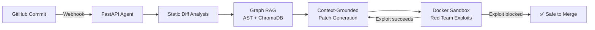

<picture>
  <source media="(prefers-color-scheme: dark)" srcset="assets/hero-dark.svg" />
  <source media="(prefers-color-scheme: light)" srcset="assets/hero-light.svg" />
  
</picture>

<picture>
  <source media="(prefers-color-scheme: dark)" srcset="assets/terminal-dark.svg" />
  <source media="(prefers-color-scheme: light)" srcset="assets/terminal-light.svg" />
  
</picture>

  <i>I build <b>systems that think</b>: an AI agent that patches vulnerabilities before merge, a vision pipeline that explains <b>why</b> a scene is dangerous, and a B2B platform where business rules live in the database instead of hardcoded <code>if</code> statements.</i>

---

### 🚀 Featured Projects

#### 🛡️ [CodeJanitor](https://github.com/Ayush1075/AWS_CODE_JANITOR): Autonomous Security Agent
> *Catches vulnerabilities on commit, patches them using real call-graph context, and proves the fix in a sandbox before merge.*

- AST-based **Graph RAG** maps cross-file dependencies, so patches are grounded in real call graphs instead of hallucinated context
- Ephemeral **Docker sandbox** runs exploit scripts against patched code with **100% host contamination prevention** across test runs

`Python` `FastAPI` `ChromaDB` `Graph RAG` `Docker`

---

#### 💼 [DealFlow360](https://github.com/Ayush1075?tab=repositories): Self-Governing B2B Quote-to-Cash Platform
> *Pricing, risk scoring, and approvals driven by database-configurable rules, with real-time sync everywhere.*

- Single-write **event pipeline** powering audit logs, live dashboards, and UI sync over **Server-Sent Events**
- **RBAC across 6 roles and 20+ capabilities**, enforced on both client and server
- Multi-warehouse fulfillment splitting, hybrid subscription billing with **day-accurate proration**, and negotiation threads that auto-reroute for re-approval when terms breach policy
- One-command Docker setup · **32 automated backend tests** covering pricing, RBAC, and fulfillment edge cases

`FastAPI` `PostgreSQL` `React` `TypeScript` `Docker` `SSE`

---

#### 👁️ [AI Scene Safety Classifier](https://github.com/Ayush1075/Ai_Scene_Classifier_Backend): Explainable Vision for Accessibility
> *Classifies scenes as Safe / Caution / Danger in real time, and explains the verdict out loud.*

- Hybrid pipeline: **DeepLabV3 semantic segmentation** + **Mamdani fuzzy-logic** controller
- Left-Center-Right spatial zoning over a **1 to 12 m range**, so risk scales with proximity *and* obstacle position
- Rule-based explainability layer cut **false-safe predictions by ~20%**, with natural-language audio output

`PyTorch` `OpenCV` `DeepLabV3` `Fuzzy Logic`

---

### 🔥 Recently Active

| Repository | What it does | Language | Stars | Last updated |
|---|---|---|---|---|
| [**keploy-go-quickstart-tutorial**](https://github.com/Ayush1075/keploy-go-quickstart-tutorial) · [Live](https://keploy-go-quickstart-tutorial.vercel.app) | Beginner-friendly Keploy tutorial for a Go (Gin + MongoDB) app, built with Next.js, MDX, Tailwind and shadcn/ui | `TypeScript` | ⭐ 0 | 2026-10-01 |
| [**Ai_Scene_Classifier_Frontend**](https://github.com/Ayush1075/Ai_Scene_Classifier_Frontend) | No description yet | `TypeScript` | ⭐ 0 | 2026-05-30 |
| [**Ayush-Gupta**](https://github.com/Ayush1075/Ayush-Gupta) | No description yet | `-` | ⭐ 0 | 2025-12-12 |
| [**Inter_Management**](https://github.com/Ayush1075/Inter_Management) | No description yet | `JavaScript` | ⭐ 0 | 2025-08-02 |
| [**Social_Media_Dashboard**](https://github.com/Ayush1075/Social_Media_Dashboard) | No description yet | `JavaScript` | ⭐ 0 | 2025-07-22 |
| [**Transmed_deploy**](https://github.com/Ayush1075/Transmed_deploy) · [Live](https://transmed-deploy.vercel.app) | No description yet | `JavaScript` | ⭐ 0 | 2025-05-31 |

---

### 💼 Experience

| Company | Role | Impact |
|---|---|---|
| **Innodatatics** · Hyderabad Jun 2025 to Jul 2025 | Full-Stack Developer (MERN) | Unified YouTube, Telegram, X and Meta analytics, **cutting manual reporting by 80% (~10 hrs/week)** · Role-aware JWT app for **200+ users** · Resume parser with **95% accuracy**, **5 days faster** hiring cycle |
| **Transmed** · Remote (Erasmus+) Mar 2025 to Jul 2025 | Full-Stack Developer (MERN) | Built and deployed a consortium platform serving **10+ global universities**, raising partner engagement **40%** · Role-based dashboards with interactive Recharts analytics |

---

### 🛠️ Tech Stack

**Languages**
 

**Backend, Frontend & DevOps**
 

**AI / ML & Creative**
 

Also: ChromaDB · Graph RAG · DeepLabV3 · Semantic Segmentation · Fuzzy Logic · Hugging Face Spaces · XR/VR · REST APIs · Server-Sent Events

---

### 📊 Activity

<picture>
  <source media="(prefers-color-scheme: dark)" srcset="assets/stats-dark.svg" />
  <source media="(prefers-color-scheme: light)" srcset="assets/stats-light.svg" />
  
</picture>
<picture>
  <source media="(prefers-color-scheme: dark)" srcset="assets/languages-dark.svg" />
  <source media="(prefers-color-scheme: light)" srcset="assets/languages-light.svg" />
  
</picture>

<picture>
  <source media="(prefers-color-scheme: dark)" srcset="assets/snake-dark.svg" />
  <source media="(prefers-color-scheme: light)" srcset="assets/snake-light.svg" />
  
</picture>

---

### 🏆 Achievements & Leadership

| | |
|---|---|
| 🥇 **Finalist**: Odoo Hackathon 2026 (national) | 🚀 **Semi-Finalist**: Flipkart GRiD 8.0 |
| 📰 **Semi-Finalist**: Economic Times Hackathon | 🇮🇳 **Qualified**: Smart India Hackathon Internals 2024 |
| 🎤 **Student Engagement & Training Lead**: hosted 20+ events including hackathons | 📊 **Placement Committee Ambassador**: leading the Data & Email team for campus placements |

---

### 📫 Let's Connect

  
  
  

<picture>
  <source media="(prefers-color-scheme: dark)" srcset="assets/footer-dark.svg" />
  <source media="(prefers-color-scheme: light)" srcset="assets/footer-light.svg" />
  
</picture>
 Auto-updated 05 Oct 2026 by a GitHub Action I wrote · <a href="https://github.com/Ayush1075/Ayush1075/blob/main/.github/scripts/build_readme.py">see how</a>

