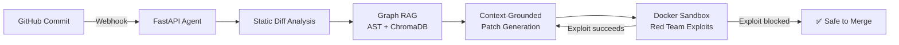

<!--
  ✏️ EDIT THIS FILE, NOT README.md
  README.md is rebuilt automatically from this template by a GitHub Action
  (on every change here + once a day). Repo links, live demos, LinkedIn and
  the "Recently Active" table are filled in from your GitHub account.
-->

<h1 align="center">Hey, I'm Ayush Gupta 👋</h1>

  

  <b>B.Tech CSE @ BML Munjal University (Class of 2027)</b> · Shipped production software for 200+ users and 10+ universities

---

### 🧭 About Me

I'm a full-stack engineer who likes building **systems that think**: an AI agent that catches and patches security vulnerabilities before merge, a vision pipeline that tells visually impaired users *why* a scene is dangerous, and a B2B platform where business rules live in the database, not in hardcoded `if` statements.

- 🔭 **Building:** **CodeJanitor**, an autonomous security agent grounded in a Graph RAG of your codebase
- 💼 **Shipped:** Production MERN apps at **Innodatatics** and for an **Erasmus+** consortium (Transmed)
- 🧠 **Exploring:** Agentic AI, retrieval systems, and explainable ML
- 🎯 **Open to:** SDE / Full-Stack / AI Engineering internships and roles
- ⚡ **Fun fact:** I also build in **Unity & XR/VR** and model in **Blender**

---

### 🚀 Featured Projects

#### 🛡️ [CodeJanitor]({{REPO:codejanitor|code-janitor|janitor}}): Autonomous Security Agent{{DEMO_LINK:codejanitor|code-janitor|janitor}}
> *Catches vulnerabilities on commit, patches them using real call-graph context, and proves the fix in a sandbox before merge.*

- AST-based **Graph RAG** maps cross-file dependencies, so patches are grounded in real call graphs instead of hallucinated context
- Ephemeral **Docker sandbox** runs exploit scripts against patched code with **100% host contamination prevention** across test runs

`Python` `FastAPI` `ChromaDB` `Graph RAG` `Docker`

---

#### 💼 [DealFlow360]({{REPO:dealflow360|dealflow|deal-flow|quote-to-cash}}): Self-Governing B2B Quote-to-Cash Platform{{DEMO_LINK:dealflow360|dealflow|deal-flow|quote-to-cash}}
> *Pricing, risk scoring, and approvals driven by database-configurable rules, with real-time sync everywhere.*

- Single-write **event pipeline** powering audit logs, live dashboards, and UI sync over **Server-Sent Events**
- **RBAC across 6 roles and 20+ capabilities**, enforced on both client and server
- Multi-warehouse fulfillment splitting, hybrid subscription billing with **day-accurate proration**, and negotiation threads that auto-reroute for re-approval when terms breach policy
- One-command Docker setup · **32 automated backend tests** covering pricing, RBAC, and fulfillment edge cases

`FastAPI` `PostgreSQL` `React` `TypeScript` `Docker` `SSE`

---

#### 👁️ [AI Scene Safety Classifier]({{REPO:scene-safety|scenesafety|safety-classifier|scene|safety}}): Explainable Vision for Accessibility{{DEMO_LINK:scene-safety|scenesafety|safety-classifier|scene|safety}}
> *Classifies scenes as Safe / Caution / Danger in real time, and explains the verdict out loud.*

- Hybrid pipeline: **DeepLabV3 semantic segmentation** + **Mamdani fuzzy-logic** controller
- Left-Center-Right spatial zoning over a **1 to 12 m range**, so risk scales with proximity *and* obstacle position
- Rule-based explainability layer cut **false-safe predictions by ~20%**, with natural-language audio output

`PyTorch` `OpenCV` `DeepLabV3` `Fuzzy Logic`

---

### 🔥 Recently Active

{{LATEST_REPOS}}

---

### 💼 Experience

| Company | Role | Impact |
|---|---|---|
| **Innodatatics** · Hyderabad Jun 2025 to Jul 2025 | Full-Stack Developer (MERN) | Unified YouTube, Telegram, X and Meta analytics, **cutting manual reporting by 80% (~10 hrs/week)** · Role-aware JWT app for **200+ users** · Resume parser with **95% accuracy**, **5 days faster** hiring cycle |
| **Transmed** · Remote (Erasmus+) Mar 2025 to Jul 2025 | Full-Stack Developer (MERN) | Built and deployed a consortium platform serving **10+ global universities**, raising partner engagement **40%** · Role-based dashboards with interactive Recharts analytics |

---

### 🛠️ Tech Stack

**Languages**
 

**Backend, Frontend & DevOps**
 

**AI / ML & Creative**
 

Also: ChromaDB · Graph RAG · DeepLabV3 · Semantic Segmentation · Fuzzy Logic · Hugging Face Spaces · XR/VR · REST APIs · Server-Sent Events

---

### 🏆 Achievements & Leadership

| | |
|---|---|
| 🥇 **Finalist**: Odoo Hackathon 2026 (national) | 🚀 **Semi-Finalist**: Flipkart GRiD 8.0 |
| 📰 **Semi-Finalist**: Economic Times Hackathon | 🇮🇳 **Qualified**: Smart India Hackathon Internals 2024 |
| 🎤 **Student Engagement & Training Lead**: hosted 20+ events including hackathons | 📊 **Placement Committee Ambassador**: leading the Data & Email team for campus placements |

---

### 📫 Let's Connect

  {{LINKEDIN_BADGE}}
  

<i>Build. Think. Adapt. Demo.</i> · Auto-updated {{UPDATED}}

